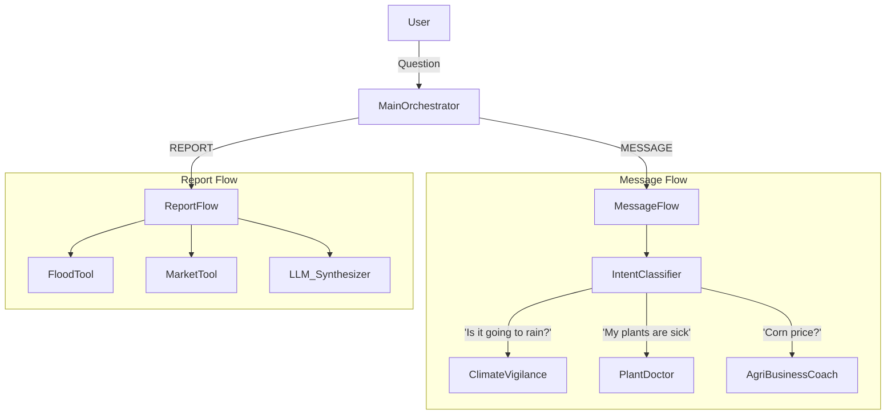

# Orchestrator (The Brain)

The **Orchestrator** is the central nervous system of AgConnect. It does not perform agricultural calculations itself but acts as the decision-maker that connects the user to the right expert (Agent) or service.

It ensures a unified experience by managing state, context, and routing logic.

## 🧠 Core Components

### 1. Main Orchestrator (`main_orchestrator.py`)
*   **Role**: Application Entry Point.
*   **Function**:
    *   Initialize the two main workflows: **Message Flow** (Reactive) and **Report Flow** (Proactive).
    *   Receives the global application state (`GlobalAgriState`).
    *   Dispatches execution based on `flow_type` ("MESSAGE" or "REPORT").

### 2. Message Response Flow (`message_flow.py`)
*   **Role**: Conversation Manager (Reactive Workflow).
*   **Function**: Handles direct interactions when a user asks a question.
*   **Process**:
    1.  **Intent Classification**: Calls `IntentClassifier` to understand if the user is asking about Weather, Crops, Soil, Health, or Market.
    2.  **Routing**: Dynamically routes the state to the specific Agent (e.g., `ClimateVigilance`, `ProductionExpert`).
    3.  **Execution**: Triggers the Agent's internal logic.
    4.  **Response**: Collects the agent's final answer and returns it to the frontend.

### 3. Daily Report Flow (`report_flow.py`)
*   **Role**: Morning Briefing Generator (Proactive Workflow).
*   **Function**: Generates the "Morning Flash" report without user input.
*   **Process**:
    1.  **Data Fetching**: Automatically gathers fresh data from multiple tools (Market prices, Satellite flood risk, generic Weather).
    2.  **Synthesis**: Uses an LLM to compile this raw data into a structured, action-oriented daily briefing (e.g., "Heatwave today: water in the evening. Market price for Maize is up.").

### 4. Intent Classifier (`intention.py`)
*   **Role**: Understanding the User.
*   **Technology**: **Hybrid System**.
    *   **Tier 1 (LLM)**: Uses a language model (Mistral/Llama3) to understand complex natural language queries.
    *   **Tier 2 (Regex/Fallback)**: Uses rigorous regular expressions (keyword matching) as a safety net if the LLM is unsure or unavailable. This ensures basic commands (e.g., "meteo", "prix") always work.

### 5. Global State (`state.py`)
*   **Role**: Context Keeper.
*   **Function**: Defines the standard data structure (`TypedDict`) passed between all nodes. It ensures that context (User location, Crop type, Query history) is preserved across the entire lifecycle of a request.

## 🔄 Data Flow

## 🛠️ Hybrid Intent Detection (Deep Dive)

The `intention.py` module implements a robust classification strategy:

1.  **LLM Prediction**: The model attempts to classify the intent with a confidence score.
2.  **Golden Rule Check**: If Confidence > 0.7 AND Intent != "UNKNOWN", we trust the LLM.
3.  **Regex Fallback**: If the LLM is uncertain, we scan the query for hardcoded keywords (e.g., `pluie`, `orage` -> `METEO`).
4.  **Final Decision**: This ensures the system is both smart (understands context) and reliable (doesn't fail on simple words).

