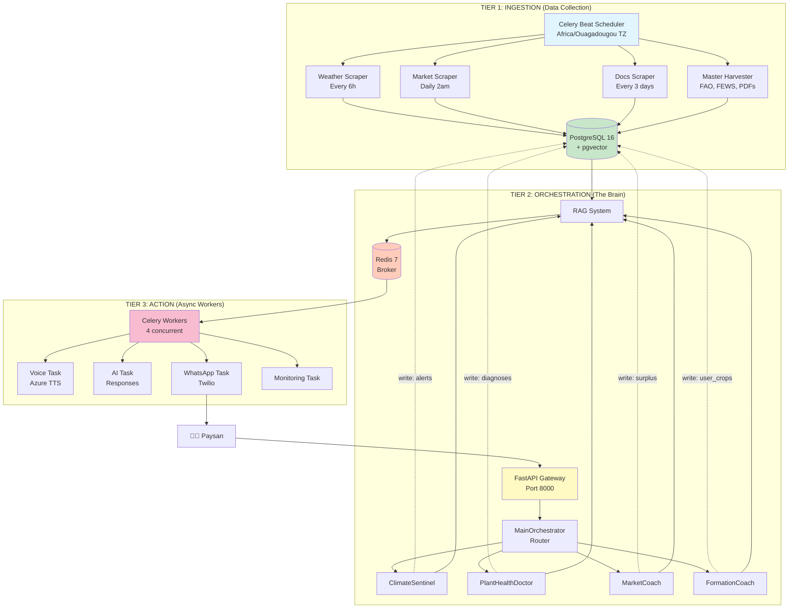

# 🏗️ AgriConnect - Architecture Technique

## 📊 Vue d'Ensemble 3-Tiers

L'architecture d'AgriConnect est conçue comme un **"Modular Monolith Event-Driven"**. Elle combine la simplicité d'un déploiement monolithique (Docker Compose unique) avec la robustesse d'une architecture orientée événements (Redis/Celery) pour la scalabilité.



---

## 🧩 Composants Détaillés

### 1. Tier 1 : Ingestion (Data Lake)
Responsable de la collecte automatique des données agricoles.
- **Workers** : Scrapers périodiques (Météo, Prix du marché, Documents techniques).
- **Stockage** : PostgreSQL 16 avec extension `pgvector` pour la recherche sémantique.
- **Modèle de données** : Schéma unique unifié (voir `backend/database/init.sql`).

### 2. Tier 2 : Orchestration (Intelligence)
Le cœur du système, géré par FastAPI et LangGraph.
- **MainOrchestrator** : Analyse l'intention utilisateur (Chat vs Expert vs Conseil Complexe).
- **Agents Spécialisés** :
  - `ClimateSentinel` : Analyse risques météo.
  - `PlantHealthDoctor` : Diagnostic maladies (vision + questions).
  - `MarketCoach` : Prix et opportunités commerciales.
  - `FormationCoach` : Guide technique.
- **RAG System** : Récupération contextuelle via LlamaIndex + pgvector.
- **Pool DB Unique** : Tous les services partagent une connexion `sqlalchemy` optimisée.

### 3. Tier 3 : Action (Exécution Asynchrone)
Gère les tâches longues ou bloquantes pour garantir une réponse API < 300ms.
- **Celery Workers** : 4 processus concurrents.
- **Tâches** :
  - Génération vocale (Azure TTS).
  - Envoi WhatsApp/SMS (Twilio).
  - Monitoring climatique continu.
  - Nettoyage et maintenance.

---

## 🔄 Flux de Données

### Mode Synchrone (Réponse Rapide)
```
User → API → Orchestrator → Agent → RAG → LLM → Réponse Texte
```
Utilisé pour les chats simples et les requêtes SMS.

### Mode Asynchrone (Vocal / Complexe)
```
User (Voice) → API → Queue (Redis) → Worker
                                       ↓
                                    Agent AI
                                       ↓
                                    Azure TTS
                                       ↓
                                    WhatsApp Send
```
L'API retourne immédiatement un `task_id`. Le traitement se fait en arrière-plan.

### Flux Proactif (Nouveauté)
Les agents ne sont pas seulement réactifs, ils **agissent** sur la base de données.
```
Agent (Market/Soil/Plant) → DB Persist
  ├─ Enregistre une offre de surplus (surplus_offers)
  ├─ Enregistre un diagnostic sol/plante (soil_diagnoses, plant_diagnoses)
  └─ Crée des rappels automatiques (reminders)
```

---

## 🛠️ Stack Technique

| Rôle | Technologie | Justification |
|------|-------------|---------------|
| **Backend** | Python 3.11 + FastAPI | Performance async, écosystème AI riche. |
| **Agents** | LangGraph | Orchestration stateful robuste. |
| **Database** | PostgreSQL 16 + pgvector | SQL standard + Vector Search en un seul outil. |
| **Broker** | Redis 7 | Faible latence, standard industriel pour Celery. |
| **Queue** | Celery 5.4 | Gestion robuste des tâches distribuées. |
| **Voice** | Azure AI Speech | Meilleure qualité TTS pour langues locales/accents. |
| **LLM** | Groq (Llama-3) | Inférence ultra-rapide pour réduire la latence. |

---

## 📂 Structure du Projet

```bash
Agribot-AI/
├── backend/
│   ├── agents/     
    ├── system/prompt.py
     # Logique métier des experts (Market, Soil, etc.)
│   ├── api/             # Endpoints FastAPI
│   ├── core/            # Config, DB Engine centralisé
│   ├── database/        # Scripts SQL (init, migrations)
│   ├── orchestrator/    # Cerveau central (Router, State)
│   ├── services/        # Intégrations (Azure, Twilio, DB Handler)
│   └── workers/         # Tâches Celery (AI, Voice, Monitoring)
├── docs/                # Documentation (ARCHITECTURE.md, DEPLOYMENT.md)
├── docker-compose.yml   # Orchestration locale/prod
└── Makefile             # Commandes rapides
```
